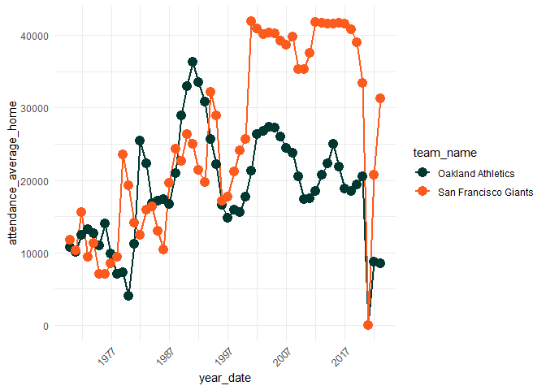

The Loneliest MLB Team: a tale of two Bay Area cities
================
Cody Flagg
5/17/2022

A recent [New York Times
article](https://www.nytimes.com/2022/05/15/sports/baseball/oakland-athletics-attendance.html)
detailed why the Oakland Athletic’s are America’s “loneliest baseball
team”.

First we visualize attendance of the Oakland Athletics compared to the
San Francisco Giants, a team that is roughly 15 miles across the bay.

Then, we see how the Oakland A’s and the SF Giants compare to the rest
of the MLB.

    ## <environment: R_GlobalEnv>

# Bay Area Attendance

-   The `y-axis` displays the average **home game attendance** per year.

<!-- -->

# Oakland vs. the entire MLB

-   `NOTE` for simplicity’s sake, we still only highlight the SF Giants
    and the Oakland A’s.
-   Notice how the A’s *historically* haven’t had the lowest attendance
    (e.g. 2000 - 2007), however they have the lowest league attendance
    as of 2022.

<!-- -->

### Next Steps

-   get number of seats per team’s stadium, and scale average attendance
    to that e.g. `average_attendance / stadium_size`
