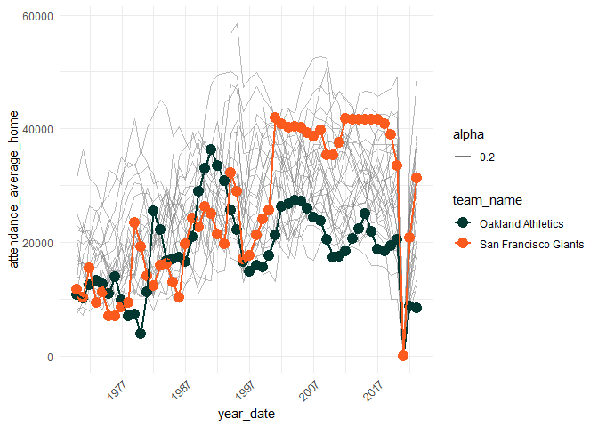

The Loneliest MLB Team: a tale of two Bay Area cities
================
Cody Flagg
5/17/2022

A recent [New York Times
article](https://www.nytimes.com/2022/05/15/sports/baseball/oakland-athletics-attendance.html)
explored why the Oakland Athletic’s are America’s “loneliest baseball
team”.

The article describes a few contributing factors, among them: closeness
to another MLB team (the San Francisco Giants), an outdated stadium
(built in 1966), the short tenure of favored players (e.g. [Mark
Canha](https://www.nytimes.com/2022/05/18/sports/baseball/mark-canha-mets.html)),
and the team owner’s strong desire to move the franchise to Las Vegas.

In particular, the A’s president states directly in the article:

    "It’s especially important to have a...visionary ballpark in Oakland because we are a two-team market...I need to compete with the Giants, and I can't..."

Just how bad is the competition with the Giants, and how has the looked
historically?

First we visualize attendance of the Oakland Athletics compared to the
San Francisco Giants, a team that is roughly 15 miles across the bay.

Then, we see how the Oakland A’s and the SF Giants compare to the rest
of the MLB.

    ## <environment: R_GlobalEnv>

# Bay Area Attendance

-   The `y-axis` displays the average **home game attendance** per year.

<!-- -->

# Oakland vs. the entire MLB

-   This chart shows MLB home game attendance **for teams that currently
    play in 2022**
-   `NOTE` for simplicity’s sake, we only colorize the SF Giants
    (orange) and the Oakland A’s (green) vs. the rest of the league
    (gray lines) to see just how different the two Bay teams are.
-   Notice how the A’s *historically* haven’t had the lowest attendance
    (e.g. 2000 - 2007), however they have the lowest league attendance
    as of 2022.
-   While the entire league has been affected by COVID-19 and game
    attendance, some are rebounding more quickly than others.

<!-- -->

### Next Steps

-   get number of seats per team’s stadium, and scale average attendance
    to that e.g. `average_attendance / stadium_size`
-   compare team salary to game attendance
-   calculate distance from home stadium to nearest neighbor for markets
    with more than one professional team (e.g. Chicago, New York, etc.),
    what does attendance look like?
